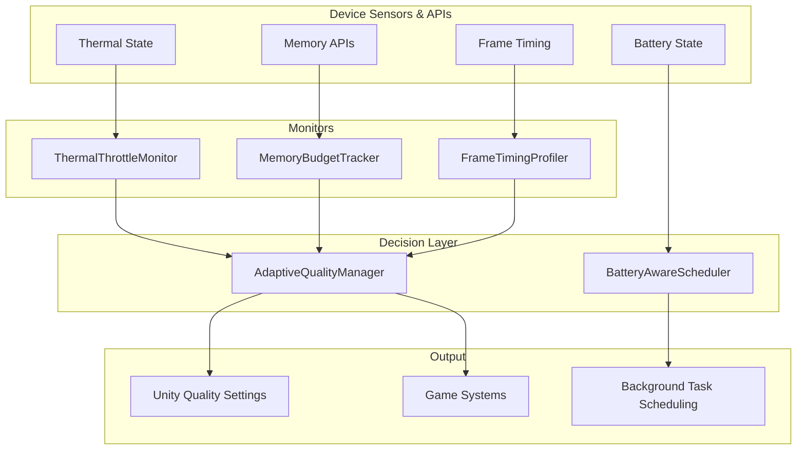

# Unity Mobile Performance Architecture

A collection of production-ready C# utility scripts for managing performance on mobile devices in Unity. These components handle [thermal throttling](https://oceanviewgames.co.uk/services/mobile), memory budgeting, frame timing analysis, adaptive quality scaling, and battery-aware task scheduling, giving you a complete performance management system for iOS and Android. Built and battle-tested by [Ocean View Games](https://oceanviewgames.co.uk/services/performanceoptimization), a studio that specialises in mobile game optimisation.

## The Problem

Mobile performance is fundamentally different from desktop or console. Devices thermally throttle under sustained load, silently dropping CPU and GPU clocks mid-session. Memory budgets vary wildly across thousands of Android SKUs, and exceeding them means a hard kill with no warning. Players notice battery drain and will uninstall games that run hot. You cannot ship a fixed quality preset and hope for the best; you need systems that monitor, adapt, and react in real time.

## Features

- **ThermalThrottleMonitor**: Real-time thermal state monitoring with event-driven notifications.
- **MemoryBudgetTracker**: Managed and native memory tracking against per-platform budgets.
- **FrameTimingProfiler**: Lightweight rolling-window frame time analysis with percentile calculations.
- **AdaptiveQualityManager**: Automatic quality tier adjustment with hysteresis to prevent oscillation.
- **BatteryAwareScheduler**: Battery-aware scheduling for heavy background work.
- **Performance Dashboard**: Editor window for real-time monitoring during Play mode.
- **Optimisation Guide**: Comprehensive documentation covering best practices and profiling workflows.

## Architecture

The five runtime components form a layered performance management system. Three monitors gather data from device sensors and Unity APIs, feeding into a central quality manager that adjusts settings automatically. The battery scheduler operates independently, gating heavy background work based on power state.

For a detailed walkthrough, see the [Mobile Optimisation Guide](docs/mobile-optimisation-guide.md).

## Quick Start

1. Copy the `Runtime/` folder into your Unity project's `Assets/` directory (or any subfolder).
2. Copy the `Editor/` folder into your project if you want the performance dashboard.
3. Add the `ThermalThrottleMonitor`, `MemoryBudgetTracker`, `FrameTimingProfiler`, and `AdaptiveQualityManager` components to a GameObject in your scene (or use a dedicated "Performance Manager" object).
4. Wire the monitor references into the `AdaptiveQualityManager` inspector fields.
5. Optionally add `BatteryAwareScheduler` if you have heavy background tasks to gate on battery state.

All components are in the `OceanViewGames.Performance` namespace.

## Component Reference

### ThermalThrottleMonitor

Monitors device thermal state and classifies it into four severity levels: Nominal, Fair, Serious, and Critical. Fires UnityEvents on state transitions so rendering, AI, and audio systems can scale back. Uses `Application.thermalState` on Unity 2022+ with a graceful fallback for older versions. Key API: `CurrentThermalLevel`, `IsThrottling`, `TimeSinceLastThrottleEvent`.

### MemoryBudgetTracker

Tracks managed heap, native, and graphics memory against a configurable per-platform budget. Supports presets for low-end Android (512 MB), mid-range (1 GB), and iOS (2 GB). Fires warning events at configurable thresholds (75%, 90%) and provides an emergency method to unload unused assets and trigger garbage collection. Key API: `GetCurrentUsageMB()`, `GetBudgetRemainingMB()`, `IsOverBudget()`, `GetAllocationBreakdown()`.

### FrameTimingProfiler

Tracks frame times over a pre-allocated rolling window (default 120 frames) with zero per-frame allocations. Calculates average frame time, 95th and 99th percentile times, and the percentage of frames hitting a configurable target (30 or 60 FPS). Detects and logs frame spikes exceeding 2x the target. Key API: `GetSummary()`, `AverageFrameTimeMs`, `SpikeCount`.

### AdaptiveQualityManager

Consumes data from the three monitors and automatically steps through five quality tiers (Ultra, High, Medium, Low, Minimal), adjusting texture resolution, shadow distance, LOD bias, particle counts, and target frame rate. Implements hysteresis so the system must remain stable at a lower tier for a configurable duration before stepping back up. Key API: `CurrentTier`, `ForceSetTier()`.

### BatteryAwareScheduler

Reads battery level and charging state via `SystemInfo.batteryLevel` and `SystemInfo.batteryStatus`. Provides a simple API to gate heavy background work (asset preloading, procedural generation, analytics uploads) on battery conditions. Queued callbacks execute automatically when conditions are met. Key API: `CanRunHeavyWork()`, `GetBatteryPercent()`, `IsCharging()`, `ScheduleWhenSafe(Action)`.

## Real-World Usage

These patterns were developed and refined during the porting of RuneScape Mobile, where a 20-year-old PC MMO had to run at stable frame rates on mid-tier phones. Thermal management was critical: sustained MMO sessions would throttle devices within minutes without adaptive quality scaling. The memory budget system prevented hard kills on 2 GB Android devices running alongside other apps. Read the full breakdown in the [RuneScape Mobile porting case study](https://oceanviewgames.co.uk/case-studies/mobile-game-porting-ui-optimization).

For server-authoritative multiplayer, [Domi Online](https://oceanviewgames.co.uk/case-studies/domi-online-unity-mmo) demonstrated how client-side performance management works alongside server optimisation to maintain smooth gameplay at 1000+ concurrent users. The adaptive quality system ensured low-end devices could still participate in large-scale events.

The [Nova Blast SDK modernisation](https://oceanviewgames.co.uk/case-studies/nova-blast-sdk-modernisation-porting) project applied these same principles during a cross-platform porting effort, proving that the architecture scales across different game genres and target platforms.

## Requirements

- **Unity 2021.3 LTS** or later.
- `ThermalThrottleMonitor` works best on **Unity 2022+** for full `Application.thermalState` API support. On older versions, it falls back to a simplified monitoring approach.
- Targets iOS and Android. All components include editor fallbacks for testing in Play mode on desktop.

## Related Reading

- [Mobile UI Design for Complex Games](https://oceanviewgames.co.uk/blog/posts/mobile-ui-design-complex-games): Practical approaches to fitting desktop-class interfaces onto mobile screens.
- [Procedural Generation and Mobile Performance](https://oceanviewgames.co.uk/blog/posts/procedural-generation-mobile-performance): Balancing runtime generation with mobile hardware constraints.
- [Mobile Game Development Services](https://oceanviewgames.co.uk/services/mobile): Our full mobile development and porting offering.
- [Performance Optimisation Services](https://oceanviewgames.co.uk/services/performanceoptimization): Dedicated performance auditing and optimisation.
- [Co-Development Services](https://oceanviewgames.co.uk/services/codevelopment): Embedded engineering support for your team.
- [Technical Audit Services](https://oceanviewgames.co.uk/services/technical-audit): Comprehensive codebase and performance reviews.

## About Ocean View Games

[Ocean View Games](https://oceanviewgames.co.uk) is a London-based Unity development studio founded by senior engineers with over a decade of experience each. Director David is a Unity Certified Expert and former Jagex Mobile Team Lead, where he led the engineering effort behind RuneScape Mobile. The studio provides [co-development](https://oceanviewgames.co.uk/services/codevelopment), [mobile porting](https://oceanviewgames.co.uk/services/mobile), [console porting](https://oceanviewgames.co.uk/services/consoleporting), and [performance optimisation](https://oceanviewgames.co.uk/services/performanceoptimization) services to game studios worldwide.

[Website](https://oceanviewgames.co.uk) | [Clutch Reviews](https://clutch.co/profile/ocean-view-games) | [LinkedIn](https://www.linkedin.com/company/ocean-view-games)

## Licence

This project is licensed under the MIT License. See [LICENSE](LICENSE) for details.
