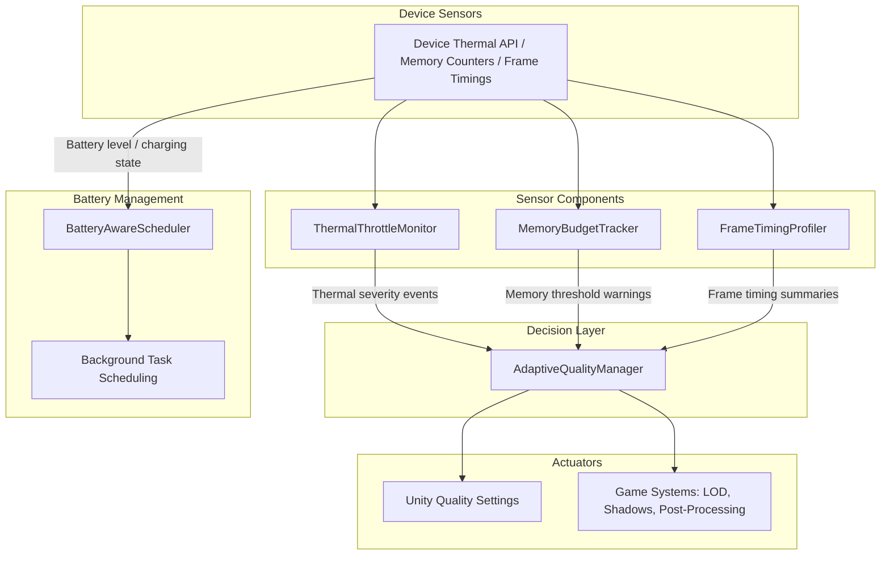

# Mobile Performance Optimisation Guide

## Overview of the Mobile Performance Challenge

Delivering a smooth, consistent experience on mobile devices is one of the hardest problems in game development. Unlike PCs or consoles, mobile hardware is designed around strict thermal and power envelopes. When a device heats up, the operating system will aggressively throttle CPU and GPU clock speeds to protect the hardware, sometimes cutting sustained performance by 40% or more. This means a game that runs perfectly in the first five minutes of a session can become a slideshow after ten if thermal behaviour is not actively managed.

Memory constraints compound the problem. A low-end Android device may have as little as 2 GB of RAM shared between the OS, background services, and your game. Exceed the operating system's memory budget and your process will be terminated without warning. At the same time, players expect small download sizes that fit within over-the-air limits, forcing developers to compress assets aggressively without visibly degrading quality. Battery drain is the final piece of the puzzle: players will uninstall a game that empties their battery in under an hour, regardless of how good the gameplay is.

Hardware fragmentation makes all of this worse. The Android ecosystem alone spans thousands of device configurations with wildly different GPU architectures (Adreno, Mali, PowerVR), driver quality, thermal designs, and memory capacities. iOS is more constrained, but older devices like the iPhone SE still need to be supported alongside the latest hardware. A robust mobile game cannot simply target one device and hope for the best; it needs a runtime performance management system that continuously adapts to the capabilities and current state of the hardware it is running on.

## System Architecture

This repository provides five runtime components that work together as an adaptive performance management system. The architecture follows a sensor, analyser, actuator pattern. Three sensor components continuously monitor the device: **ThermalThrottleMonitor** polls the operating system's thermal state, **MemoryBudgetTracker** samples managed, native, and graphics memory allocation against configurable budgets, and **FrameTimingProfiler** tracks per-frame durations over a rolling window to detect stutters and sustained performance drops.

These three sensors feed their data into the **AdaptiveQualityManager**, which acts as the central decision-maker. When the thermal monitor reports that the device is entering a serious or critical state, when memory usage crosses a warning threshold, or when frame times consistently exceed the target budget, the AdaptiveQualityManager responds by adjusting Unity's quality settings. It can lower the rendering resolution, reduce shadow quality, disable post-processing effects, or switch LOD bias to bring the workload back within the device's current capabilities. When conditions improve, it gradually restores quality to the highest sustainable level.

The fifth component, **BatteryAwareScheduler**, operates semi-independently. Rather than feeding into the quality manager, it controls the scheduling of background tasks such as analytics uploads, asset pre-loading, and save-game synchronisation. When battery level is low or the device is not charging, the scheduler defers non-essential work to conserve power. Together, these five components form a closed-loop system that keeps the game running smoothly across the full spectrum of mobile hardware.

## Data Flow



## Component Deep Dives

### ThermalThrottleMonitor

The `ThermalThrottleMonitor` polls the operating system's thermal state at a configurable interval and translates it into four severity levels: Nominal, Fair, Serious, and Critical. On iOS this maps directly to `NSProcessInfo.thermalState` via Unity's `Application.thermalState` API (Unity 2022.1+). On Android it uses `PowerManager.getThermalHeadroom()` where available (API level 30+).

The component exposes UnityEvents for three situations: any thermal state transition, the moment throttling begins (entering Serious or Critical), and the moment throttling ends. This event-driven design means other systems can react immediately without polling the monitor themselves. The `IsThrottling` property provides a simple boolean check for code that just needs to know whether to reduce workload.

**Integration example:**

```csharp
// Wire up in the Inspector or via code:
thermalMonitor.OnThrottlingBegan.AddListener(() =>
{
    // Reduce particle counts, disable post-processing, lower resolution
    adaptiveQualityManager.RequestQualityReduction();
});
```

### MemoryBudgetTracker

The `MemoryBudgetTracker` samples Unity's managed heap, native engine memory, and graphics driver allocation at regular intervals and compares the total against a configurable budget. It ships with three platform presets (Low-End Android at 512 MB, Mid-Range Android at 1024 MB, Standard iOS at 2048 MB) and supports custom budgets set at runtime.

Two warning thresholds (default 75% and 90%) fire events before the budget is fully exhausted, giving game systems time to respond by unloading unused assets, reducing cache sizes, or lowering texture resolution. When the budget is exceeded, an optional auto-cleanup mode triggers `Resources.UnloadUnusedAssets()` followed by a full garbage collection pass. The `AllocationBreakdown` struct provides a detailed view of where memory is being consumed, which is invaluable for debugging.

**Integration example:**

```csharp
memoryTracker.SetBudgetPreset(MemoryBudgetTracker.BudgetPreset.LowEndAndroid);

memoryTracker.onCriticalThresholdReached.AddListener(() =>
{
    // Flush texture caches, reduce pool sizes
    assetManager.ReduceMemoryFootprint();
});
```

### FrameTimingProfiler

The `FrameTimingProfiler` records per-frame durations into a pre-allocated circular buffer and computes statistics over a configurable rolling window (default 120 frames). It calculates average frame time, 95th and 99th percentile times, the percentage of frames that met the target budget, and a count of spike frames (those exceeding twice the budget).

All computation is zero-allocation by design. The profiler uses a pre-allocated scratch buffer for percentile sorting, so calling `GetSummary()` does not generate garbage. This makes it safe to query every frame if needed. Spike detection can optionally log warnings to the console, making it easy to spot hitches during development.

**Integration example:**

```csharp
FrameTimingSummary summary = frameProfiler.GetSummary();

if (summary.PercentageOnTarget < 90f)
{
    // Performance is degraded; ask the quality manager to step down
    adaptiveQualityManager.StepDownQuality();
}
```

### AdaptiveQualityManager

The `AdaptiveQualityManager` consumes data from the three sensor components and makes decisions about which quality settings to adjust. It maintains an ordered list of quality reduction steps, from least noticeable to most aggressive. A typical configuration might be:

1. Disable screen-space ambient occlusion
2. Reduce shadow resolution from 2048 to 1024
3. Lower render scale from 1.0 to 0.85
4. Reduce shadow resolution to 512
5. Lower render scale to 0.7
6. Disable real-time shadows entirely

The manager applies reductions one step at a time, waiting for conditions to stabilise before applying the next. When sensor readings improve, it reverses the steps with a configurable cooldown to avoid oscillation. This graduated approach ensures that players experience the highest quality their device can sustain at any given moment.

### BatteryAwareScheduler

The `BatteryAwareScheduler` monitors battery level and charging state to control when non-critical background work executes. Tasks are assigned priority levels (essential, preferred, deferrable), and the scheduler suppresses lower-priority work when battery is below configurable thresholds.

For example, analytics event batching might be deferred until the device is charging, while save-game uploads remain active but are spaced further apart. Asset pre-loading for upcoming levels can be paused entirely when battery drops below 20%. This approach keeps the core gameplay experience intact while minimising unnecessary power consumption.

## Best Practices

### Texture Compression Formats by Platform

Choosing the correct texture compression format has a significant impact on memory usage, GPU bandwidth, and visual quality.

| Platform | Recommended Format | Notes |
|----------|-------------------|-------|
| iOS | ASTC | Supported on all Metal-capable devices. Use 4x4 blocks for high quality, 6x6 or 8x8 for lower memory usage on less important textures. |
| Android (modern) | ASTC | Preferred on devices with OpenGL ES 3.1+ or Vulkan. Offers the best quality-to-size ratio. |
| Android (broad compatibility) | ETC2 | Required fallback for OpenGL ES 3.0 devices. Quality is acceptable but inferior to ASTC for textures with alpha channels. |
| Android (legacy) | ETC1 + split alpha | Only needed if targeting very old devices (pre-2013). Consider dropping support for these devices instead. |

Use Unity's platform-specific texture override settings to ship ASTC on capable devices and ETC2 as a fallback. Avoid uncompressed textures entirely; even UI atlases should be compressed.

### Draw Call Budgets

Mobile GPUs are far more sensitive to draw call count than desktop GPUs. As a general guideline:

- **Low-end devices (Mali-400, Adreno 306):** target fewer than 100 draw calls per frame
- **Mid-range devices (Mali-G72, Adreno 618):** target 150 to 250 draw calls per frame
- **High-end devices (Apple A14+, Snapdragon 8 Gen 1):** can handle 300 to 500 draw calls, but fewer is always better

Strategies to reduce draw calls:

- Use static and dynamic batching where appropriate
- Enable GPU instancing for repeated meshes (vegetation, debris, crowds)
- Combine materials with texture atlases to reduce material switches
- Use SRP Batcher with the Universal Render Pipeline to minimise SetPass calls
- Minimise the number of active cameras and canvas elements in your UI

### Shader Complexity on Mobile GPUs

Mobile GPUs have fundamentally different architectures from desktop GPUs. Most use tile-based deferred rendering (TBDR), which changes how you should think about shader cost.

- **Use half precision (`half`, `fixed`) wherever possible.** Many mobile GPUs process half-precision operations at twice the throughput of full precision. Colour values, UV coordinates, and normalised directions almost never need `float`.
- **Avoid dynamic branching.** Mobile GPU shader cores process fragments in lockstep. A branch that diverges within a warp forces both paths to execute, negating any performance benefit.
- **Minimise texture samples.** Each texture fetch is expensive on mobile due to bandwidth constraints. Combine data into fewer textures (pack roughness, metallic, and AO into a single RGB texture).
- **Avoid alpha testing (clip/discard).** On TBDR architectures, discarding fragments breaks early-Z optimisation and forces the GPU to process the full fragment before it can determine visibility.
- **Keep vertex shader work light.** Skinned mesh vertices are particularly expensive. Reduce bone counts to 30 or fewer per mesh where possible.
- **Prefer baked lighting over real-time.** Light probes and lightmaps are dramatically cheaper than real-time lights on mobile. If you must use real-time lights, keep the count to one or two per object.

### Garbage Collection Strategies

Garbage collection pauses are one of the most common causes of frame hitches on mobile. Unity's Boehm garbage collector is stop-the-world, meaning all managed threads pause during collection. Even the incremental GC mode introduced in later Unity versions can cause visible stutters on low-end hardware.

**Object pooling** is the single most effective mitigation. Pre-allocate frequently used objects (projectiles, particle effects, UI elements, enemy instances) and recycle them instead of calling `Instantiate` and `Destroy`. Use a pool manager that grows gracefully and logs warnings when pools are exhausted.

**Avoid boxing.** Passing value types (int, float, struct) to methods that expect `object` or interfaces causes a heap allocation. Use generic collections (`List<int>` rather than `ArrayList`) and avoid LINQ in hot paths.

**Cache component references.** Calling `GetComponent<T>()` every frame generates garbage. Cache the result in `Awake` or `Start` and reuse it.

**Pre-allocate collections.** Initialise lists, dictionaries, and arrays with known capacities to avoid repeated resizing. Use `stackalloc` or `NativeArray` for temporary buffers in performance-critical code.

**Use string operations carefully.** String concatenation with `+` allocates a new string each time. Use `StringBuilder` for multi-part string construction, or use interpolated strings only in code paths that do not run every frame.

## Profiling Workflow

Effective optimisation requires measuring before and after every change. Guessing at performance bottlenecks wastes time and can make things worse.

### Unity Profiler

The built-in Unity Profiler is your first line of investigation. Connect to a development build running on the target device over USB or Wi-Fi.

- **CPU Module:** Identify which systems consume the most frame time. Look for spikes in scripting, rendering, and physics. The timeline view shows exactly when each system runs within a frame.
- **Memory Module:** Track managed and native allocations over time. Use the "Take Sample" feature to capture detailed snapshots showing every live object and its retention chain.
- **Rendering Module:** Monitor draw calls, triangles, batching efficiency, and SetPass calls. Compare against the budgets listed above.
- **GC Alloc column:** Sort by GC allocation in the CPU module to find scripts that allocate on the managed heap every frame. Eliminate these allocations using the strategies described above.

### Xcode Instruments (iOS)

For iOS-specific profiling, Xcode Instruments provides hardware-level detail that the Unity Profiler cannot.

- **Metal System Trace:** Shows GPU utilisation, shader execution time, and bandwidth usage. This is essential for identifying GPU-bound scenarios.
- **Time Profiler:** Provides CPU profiling with full call stacks, including native Unity engine code that is invisible to the managed profiler.
- **Allocations Instrument:** Tracks every memory allocation, including native allocations that Unity's profiler does not report.
- **Energy Log:** Measures CPU, GPU, network, and location energy impact. Use this to verify that your battery optimisations are effective.
- **Thermal State:** Monitors the device's thermal state over time, which you can correlate with the `ThermalThrottleMonitor` readings.

### Android GPU Inspector (AGI)

For Android GPU profiling, Android GPU Inspector provides vendor-specific insights.

- **Frame Profiler:** Captures individual frames and lets you step through every draw call, inspecting the bound textures, shaders, and render state.
- **System Profiler:** Shows CPU, GPU, and memory activity on a unified timeline. Look for GPU bubbles (idle time caused by CPU submission delays) and CPU stalls (waiting for GPU results).
- **Shader Profiler:** Analyses shader execution on Adreno and Mali GPUs, showing ALU utilisation, register pressure, and texture fetch costs.
- **Vulkan validation:** If using Vulkan, enable validation layers to catch API misuse that could cause driver overhead or undefined behaviour.

For both platforms, always profile on real hardware. The Unity Editor and device emulators do not accurately represent mobile GPU behaviour, thermal throttling, or memory pressure.

## Real-World Examples

The principles described in this guide have been applied at scale across multiple commercial projects.

### RuneScape Mobile

The porting of RuneScape to mobile devices is one of the most challenging examples of mobile performance optimisation in practice. The game's complex UI systems, large open world, and real-time multiplayer architecture required extensive reworking to run within mobile thermal and memory budgets. Adaptive quality management, aggressive texture compression, and draw call reduction were all essential to delivering a playable experience on mid-range devices. Read the full case study: [Mobile Game Porting and UI Optimisation](https://oceanviewgames.co.uk/case-studies/mobile-game-porting-ui-optimization).

### Further Case Studies and Articles

- [Domi Online: Unity MMO Development](https://oceanviewgames.co.uk/case-studies/domi-online-unity-mmo) covers the challenges of building a mobile MMO with persistent world state and large player counts.
- [Nova Blast: SDK Modernisation and Porting](https://oceanviewgames.co.uk/case-studies/nova-blast-sdk-modernisation-porting) demonstrates how modernising an older codebase can unlock significant performance improvements on current hardware.
- [Unity Mobile Strategy Game Development](https://oceanviewgames.co.uk/case-studies/unity-mobile-strategy-game-development) explores performance management in a genre that combines complex simulation with rich visual presentation.
- [Mobile UI Design for Complex Games](https://oceanviewgames.co.uk/blog/posts/mobile-ui-design-complex-games) discusses how UI architecture affects rendering performance and memory usage on mobile.
- [Procedural Generation and Mobile Performance](https://oceanviewgames.co.uk/blog/posts/procedural-generation-mobile-performance) examines techniques for generating content at runtime without exceeding mobile CPU and memory budgets.

## Further Resources

- [Mobile Development Services](https://oceanviewgames.co.uk/services/mobile) provides an overview of mobile development and porting capabilities.
- [Performance Optimisation Services](https://oceanviewgames.co.uk/services/performanceoptimization) covers dedicated profiling, optimisation, and performance consulting for studios working on mobile titles.
